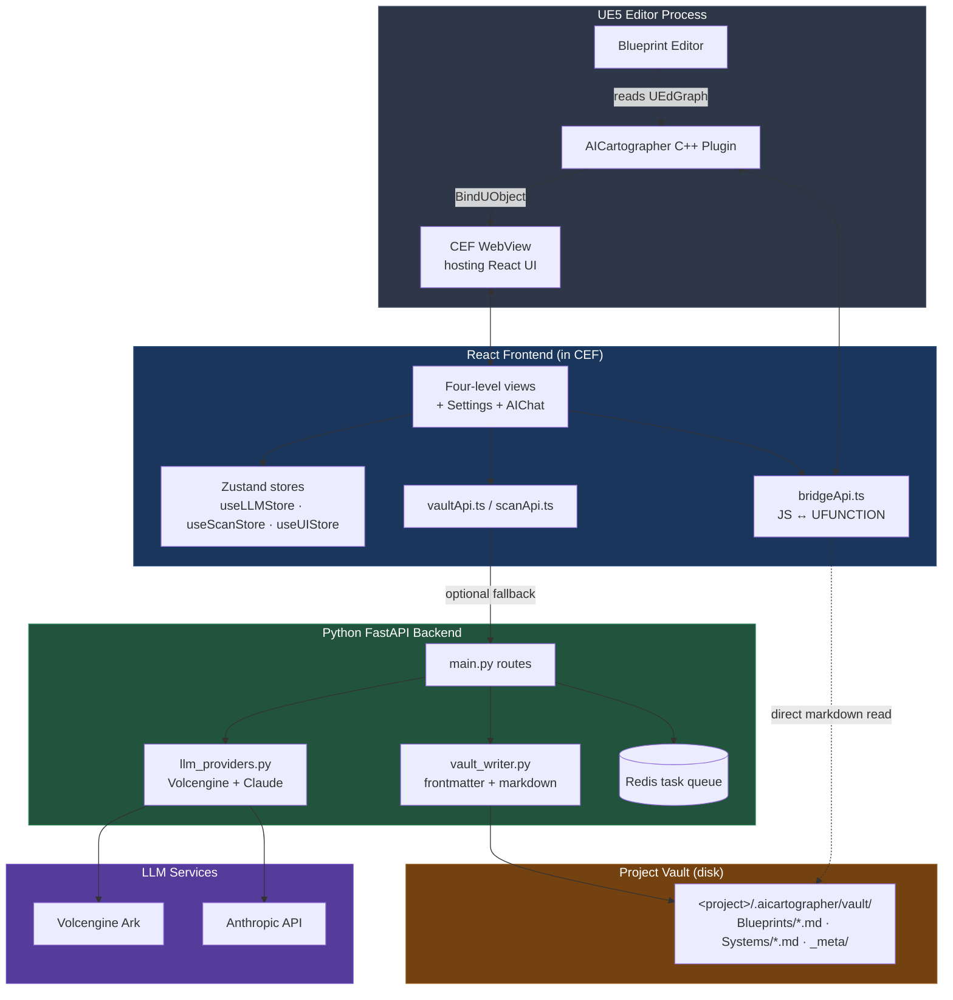

<div align="center">

# AICartographer

**English · [简体中文](README.md)**

**An AI-powered blueprint cartographer for Unreal Engine 5**

Fold an entire UE5 project into a clickable, narratable, analyzable map — let the LLM tell you what each blueprint does and who calls whom, let force-directed graphs reveal the system shape, let a Markdown vault keep your notes permanently next to your project.

[](https://www.unrealengine.com/)
[](https://react.dev/)
[](https://vitejs.dev/)
[](https://fastapi.tiangolo.com/)
[](#license)

[Features](#features) · [Architecture](#architecture) · [Four-Level Views](#four-level-views) · [Quick Start](#quick-start) · [Portable](#portable-install-recommended) · [LLM Providers](#llm-providers) · [Development](#development)

</div>

---

## What Is This

AICartographer is a React plugin embedded in the UE5 editor + a Python backend that uses an LLM to build a "narrative map" of every blueprint in your project:

- **Not just another blueprint browser** — it tells stories: each BP's markdown page narrates "`OnDamageReceived` is broadcast when `CurrentHP <= 0`, consumed by `GameMode.HandleDeath`", instead of dryly listing variable names.
- **Not just another AI tool** — it produces real assets that belong to your project: every LLM analysis, note, and tag lands in `<project>/.aicartographer/vault/` as `.md` files — **one local copy per developer**, not committed to git ([here's why and the onboarding flow](#team-collaboration-vault-is-per-developer)).
- **Not a cloud tool** — both UE editor and backend run on your machine. LLM keys are entered by you and live only in `localStorage`.

> Who's it for: developers handling medium-to-large UE5 projects, especially those who want to ramp up on someone else's code or revisit their own old projects. The first time you pull a 50+ blueprint project, this thing lets you skip 80% of the rubble.

---

## Features

| Category | What It Does |
|---|---|
| **AI Narration** | LLM writes a five-section narrative for every blueprint: INTENT / EXECUTION FLOW / MEMBER INTERACTIONS / EXTERNAL COUPLING / RISK |
| **System Clustering** | Project-level L1 LLM clusters blueprints into 3-8 systems (combat / ai / spawn / ui ...) and writes cross-system coupling analysis |
| **Four-Level Views** | Lv0 card wall → Lv1 system-level graph → Lv2 single blueprint detail → Lv3 K2Node flow inside a function |
| **Dual View Modes** | Toggle any node between "Markdown reading" and "force-directed graph" with one click |
| **Multi-Provider LLM** | Supports both Volcengine (Doubao / DeepSeek and other Ark endpoints) and Anthropic Claude (with five extended-thinking effort tiers) |
| **Full i18n** | UI + LLM output toggle between English and Simplified Chinese; controlled vocab and asset_paths stay English for compat |
| **Persistent Notes** | The `## [ NOTES ]` section is developer-private — re-scans never overwrite it; AST changes flag `notes_review_needed` |
| **Local-First** | Prefers UE C++ Bridge for direct vault access; gracefully falls back to HTTP when backend unreachable; AI Chat degrades cleanly offline |
| **Incremental Scan** | AST-hash hits are skipped; framework scan (no LLM) / deep scan (single-node LLM) / batch scan (full LLM) are three independent tiers |

---

## Architecture



**Bridge priority**: when the C++ Bridge is available, traffic goes through it (no Python required); when methods are missing, it falls back to `localhost:8000` HTTP. LLM calls always go through the backend (the Bridge never holds keys).

---

## Four-Level Views

| Level | Name | What You See | Data Source |
|---|---|---|---|
| **Lv0** | CardWall | Project overview: card wall of all systems / blueprints / C++ / interfaces | `Systems/_overview.md` + full vault index |
| **Lv1** | SystemGraph / SystemMarkdown | Members of one system as a force-directed graph, or its narrative `.md` | `Systems/<axis>.md` |
| **Lv2** | BlueprintFocus / BlueprintGraph | Detail of one blueprint: Exports / Variables / Edges / Backlinks, or its members as a graph | `Blueprints/<name>.md` |
| **Lv3** | FunctionFlow | K2Node execution graph inside one function (events red / calls blue / branches brown / casts green; exec edges animated) | C++ Bridge `ReadBlueprintFunctionFlow` reads UEdGraph directly |

Helpers:
- **AIChat** — bottom-right floating panel; feeds the current Lv2 node to the LLM as context
- **QuickSwitcher** — `Cmd/Ctrl+P`; fuzzy match on title / tag / intent
- **Settings** — project root + LLM provider config + language toggle + Rebuild backlinks / Rebuild MOCs

> _Screenshots TBD — drop `lv0-cardwall.png` `lv1-graph.png` `lv2-focus.png` `lv3-flow.png` into `docs/images/` and update the references below._
>
> 
> 

---

## Team Collaboration (vault is per-developer)

The vault content (`<project>/.aicartographer/vault/*.md`) — LLM-written narratives + structured frontmatter for each blueprint — is **one local copy per developer**. It is not committed to git, for two reasons:

- LLM output drifts between runs → committing it produces huge diffs and frequent merge conflicts
- The vault depends on each developer's LLM key, model choice, and scan timing → no two developers will produce identical `.md` files

### New Team Member Flow

1. Pull the code (your UE project, no vault attached)
2. Launch the plugin, configure your LLM key and model (Settings panel)
3. Click **Run framework scan** (seconds, no LLM, writes the skeleton)
4. Top bar → **Run project scan** (first full scan takes ~15-30 min depending on project size and model)
5. Develop normally; the AssetRegistry stale listener (roadmap Phase A1) will auto-mark notes that need rescanning

### What's Shared vs. Local

| Shared (in git) | Local (per-developer) |
|---|---|
| UE project code + AICartographer plugin | `.aicartographer/vault/Blueprints/*.md` |
| Backend config (excluding `backend/.env.local`) | `.aicartographer/vault/Systems/*.md` |
| Vocabulary (`_meta/tag-vocabulary.json`, optionally shared) | Your local LLM key |

**Your UE project's `.gitignore` must include**:

```gitignore
.aicartographer/
```

(If you forked the AICartographer repo itself, this rule is already in our `.gitignore`.)

---

## Quick Start

Two paths:

| You are | Take this | Total time |
|---|---|---|
| Just want to use it / send it to a teammate | [**Portable Install**](#portable-install-recommended) — 1.6 MB zip, three `.bat` files | ~10 min |
| Want to hack on the source | [**Build from Source**](#build-from-source) — clone + npm + pip | ~30 min |

---

## Portable Install (recommended)

> For people who just want it running — no repo clone, no Node, no Memurai. The bundled portable Redis is shipped inside the zip.

### Prerequisites

- Windows 10 / 11
- **Unreal Engine 5.6+**
- **Visual Studio 2022** with the "Desktop development with C++" workload — UE compiles the plugin on first project open
- **Python 3.11+** — make sure to tick "Add Python to PATH" during install ([python.org/downloads](https://www.python.org/downloads/))
- **LLM API key**: Volcengine endpoint id (`ep-...`) + key, or Anthropic API key
- **A C++ UE project** as a test bed; if you don't have one, grab the free [Cropout sample](https://www.unrealengine.com/marketplace/en-US/product/cropout-sample-project) from Epic Launcher → Marketplace

### Steps (~10 min)

1. **Get the zip** — download from [GitHub Releases](https://github.com/Liamour/UE-Mapping/releases), or build it yourself:
   ```powershell
   git clone https://github.com/Liamour/UE-Mapping.git
   cd UE-Mapping
   .\dist\build-release.ps1
   # → release/AICartographer-Portable-<date>.zip (1.6 MB)
   ```

2. **Unzip + start the backend** — extract anywhere (e.g. `D:\AICartographer\`), double-click `START.bat`
   - First run auto-creates a venv and pip-installs deps (1-3 min)
   - Look for `OK Backend healthy at http://127.0.0.1:8000/api/health`
   - **Keep this window open** — closing it stops the backend. Press Ctrl+C inside the window to stop cleanly.

3. **Install the plugin into a UE project** — double-click `INSTALL-PLUGIN.bat`
   - Auto-detects projects under `Documents\Unreal Projects\`; pick a number or paste a `.uproject` path
   - Copies `plugin/AICartographer/` → `<your project>/Plugins/AICartographer/`
   - Patches `.uproject` to add the plugin to `Plugins[]` and enable it

4. **First-time open of `.uproject`** — double-click your `.uproject`
   - UE prompts "Missing Modules" → click **Yes** to rebuild (VS compiles the plugin in the background, 1-2 min)
   - Blueprint-only projects will first prompt to "Add C++ class" to convert the project (one-time)
   - UE opens automatically when the build is done

5. **Open the panel + configure** — UE menu `Window` → `Developer Tools` → `Misc` → `AICartographer Web UI`
   - Top-right gear → **Settings**
   - **Project root**: the folder containing your `.uproject` (e.g. `D:\MyGame`)
   - **Language**: English / 简体中文
   - **LLM Provider**: pick Volcengine or Claude → fill in the key → click **Test connection** (green = good)
   - Settings → **Run framework scan** (instant, free, writes skeleton `.md`s)
   - Top bar → **Run project scan** (uses LLM tokens, 30s-few minutes)
   - Hop into **Lv0** overview → click a system for **Lv1** → click a blueprint for **Lv2** → click a function for **Lv3**

The vault lands in `<your project>/.aicartographer/vault/` — **local to your machine**, not committed to git ([Team Collaboration section](#team-collaboration-vault-is-per-developer) explains why). Detailed troubleshooting in [INSTALL.md](INSTALL.md) and `README-FIRST.txt` inside the zip.

### What's inside the zip

```
AICartographer-Portable-<date>/
├── START.bat                 ← start the backend (double-click)
├── STOP.bat                  ← stop / clean up leftovers
├── INSTALL-PLUGIN.bat        ← copy the plugin into a UE project
├── README-FIRST.txt          ← 5-minute end-user guide
├── backend/                  ← Python backend source (100 KB)
├── plugin/AICartographer/    ← UE plugin + prebuilt React WebUI (580 KB)
├── runtime/redis/            ← portable Redis binaries (2.9 MB)
└── tools/                    ← launcher.py / install_plugin.py / stop.py
```

After the first launch a `runtime/python-venv/` directory is created (~150-200 MB) holding fastapi/uvicorn/anthropic/openai etc.

---

## Build from Source

> If you want to hack on the code. If you only want to *use* it, take the portable path above.

### Prerequisites

- **UE 5.7+** (with the AICartographer plugin built)
- **Python 3.11+** (3.14 recommended; Windows users: add `C:\Python<ver>\Scripts` to PATH)
- **Node 20+** (frontend dev; the UE webview eats the prebuilt single-file bundle)
- **Redis** (task queue; the bundled Win 3.0.504 works via pipeline-HSET workaround)
- **LLM API key**: a Volcengine ark.cn-beijing.volces.com endpoint id, or an Anthropic API key

### 1. Clone + install

```bash
git clone https://github.com/Liamour/UE-Mapping.git
cd UE-Mapping

# Backend
cd backend
pip install -r requirements.txt

# Frontend
cd ../UE_mapping_plugin
npm install
```

### 2. Start backend

```powershell
# Redis
D:\path\to\Redis-x64-3.0.504\redis-server.exe

# FastAPI (new terminal)
cd backend
python -m uvicorn main:app --reload --port 8000
```

### 3. Build the frontend bundle into the plugin

```bash
cd UE_mapping_plugin
npm run build
# Auto-writes to ../Plugins/AICartographer/Resources/WebUI/index.html (~508 kB single file)
```

### 4. Open your project in UE

- Copy `Plugins/AICartographer/` into your UE project's `Plugins/`
- Rebuild the C++ module in VS / Rider (Live Coding can't register new UFUNCTIONs)
- Open the editor → AICartographer tab

### 5. Configure + first scan

1. Settings → Project root: point to your UE project directory
2. Settings → LLM provider: enter your key (Volcengine or Claude) → Test connection
3. Pick a language (English / 简体中文)
4. Settings → **Run framework scan** (no LLM, runs in seconds) → writes skeleton `.md`s
5. Top bar **Run project scan** (L2 batch + L1 cluster, takes 30s to a few minutes depending on project size)
6. Hop into Lv0 for the project overview, click a system for Lv1, click a blueprint for Lv2, click a function for Lv3

### Build a portable zip for a teammate

```powershell
.\dist\build-release.ps1                 # → release/AICartographer-Portable-<date>.zip
.\dist\build-release.ps1 -Version 1.0.0  # custom version label
.\dist\build-release.ps1 -NoZip          # folder only, useful for local smoke tests
```

The build script copies only — it **does not modify** any source. The resulting zip is 1.6 MB (3.6 MB unpacked).

---

## LLM Providers

| Provider | Endpoint | Model Options | Effort Tiers |
|---|---|---|---|
| **Volcengine Ark** | `ark.cn-beijing.volces.com` | Self-supplied endpoint id (`ep-...`, can target Doubao / DeepSeek-R1 etc.) | — |
| **Anthropic Claude** | Official API | Opus / Sonnet / Haiku | low / medium / high / extra_high / max (mapped to extended-thinking budget) |

**Key safety**:
- Users enter keys in the frontend; stored in `localStorage` under `aicartographer.llm.config`
- Each request ships the key in its payload to the backend; the backend **never persists** it
- The backend `.env` has zero LLM key fields

**Tunables** (Settings → LLM provider):
- Concurrency 1–64 (default 20, clamped to avoid hitting provider RPM limits)
- Language EN / ZH (affects both UI and LLM output)
- 90s per-call timeout + tenacity retry x4 (exponential 1–30s backoff)

---

## Internationalization

Toggle `Settings → Language → English` or `简体中文`:

- ✅ Entire UI (21 components)
- ✅ LLM narrative output (intent, section bodies)
- ✅ Markdown templates (`## [ INTRO ]` `## [ MEMBERS ]` `## [ BACKLINKS ]`)
- ✅ Risk callouts (`> [!system_risk] System risk: **warning**`)
- ❌ Controlled vocab stays English (`#system/combat` `#layer/gameplay` etc., they're parser keys)
- ❌ `asset_path` / blueprint name / function identifier (asset unique IDs)

> Existing `.md`s are not retroactively re-translated — re-scan needed (delete vault / change AST / hit Rebuild backlinks for at least the backlinks region)

---

## Project Structure

```
UE-Mapping/
├── Plugins/AICartographer/              # UE5 C++ plugin
│   ├── Source/AICartographer/
│   │   ├── Public/AICartographerBridge.h     # UFUNCTION exposure layer
│   │   └── Private/AICartographerBridge.cpp  # ReadBlueprintFunctionFlow / RequestDeepScan / ListBlueprintAssets
│   └── Resources/WebUI/index.html       # vite-plugin-singlefile bundle output
│
├── UE_mapping_plugin/                   # React frontend
│   └── src/
│       ├── components/
│       │   ├── levels/                  # Lv0 / Lv1 / Lv2 / Lv3 views
│       │   ├── shell/                   # ActivityBar / TopBar / Tabs / Breadcrumb
│       │   ├── settings/                # SettingsModal / LLMProviderPanel / ScanOrchestrator
│       │   ├── chat/AIChat.tsx
│       │   ├── search/QuickSwitcher.tsx
│       │   └── notes/NotesEditor.tsx
│       ├── services/
│       │   ├── bridgeApi.ts             # C++ Bridge wrapper
│       │   ├── vaultApi.ts              # Vault HTTP/Bridge dual transport
│       │   ├── scanApi.ts               # Batch scan
│       │   ├── frameworkScan.ts         # Skeleton scan (no LLM)
│       │   └── projectScan.ts           # L1 project clustering
│       ├── store/
│       │   ├── useLLMStore.ts           # Provider + language + concurrency
│       │   ├── useScanStore.ts          # Scan progress + auto-refresh
│       │   └── useUIStore.ts            # View mode + modal state
│       └── utils/
│           ├── i18n.ts                  # useT() Hook + L10nMsg type
│           └── frontmatter.ts           # YAML parser + nested→flat normalizer
│
├── backend/                             # Python FastAPI
│   ├── main.py                          # Routes + L2 / L1 prompts
│   ├── llm_providers.py                 # LLMProvider ABC + Volcengine + Claude
│   ├── vault_writer.py                  # Markdown writer + i18n template tables
│   ├── tag_vocabulary_default.json      # Controlled vocab (system/layer/role)
│   └── requirements.txt
│
├── HANDOFF.md                           # Cross-session full project handoff (Chinese)
└── README.md                            # Chinese version of this file
```

---

## Development

### TypeScript type check

```bash
cd UE_mapping_plugin
npx tsc --noEmit
```

### Frontend dev server (HMR)

```bash
npm run dev
# Browser dev only; the UE webview eats the built bundle
```

### Backend syntax check

```bash
cd backend
python -c "import ast; ast.parse(open('main.py', encoding='utf-8').read())"
```

### Adding a new UFUNCTION

Every new method added to `AICartographerBridge.h` requires a **close UE → rebuild in VS / Rider → reopen editor** cycle. Live Coding cannot register new UCLASS / UPROPERTY / UFUNCTION. The Settings modal's bridge status row will show `partial` (bridge found but methods missing) to flag when a rebuild is needed.

### Console conventions

Backend logs use `[SYS_LOG]` `[SYS_WARN]` `[SYS_ERR]` `[L1]` `[VAULT]` prefixes for easy grep. LLM keys go through `mask_key()` before logging.

---

## Known Limitations

- **Redis 3.0.504** (Windows bundled) does not support multi-field HSET — worked around with pipeline + single-field writes. To upgrade, switch to [Memurai](https://www.memurai.com/) or WSL2 + official Redis 7.x.
- **Live Coding limit** — see above; new UFUNCTIONs require a cold rebuild.
- **Language switch does not retroactively translate old .md files** — `is_unchanged()` skips AST-stable nodes; force-rescan needed to rewrite the templates with the new language.
- **L3 has no LLM analysis yet** — currently L3 is visualization only; textual analysis lives in L2's `MEMBER INTERACTIONS` section.

---

## Roadmap

- [ ] Real-project large-scale validation (500+ BP project)
- [ ] AIChat: feed the currently open Lv2/Lv3 node to the LLM as context
- [ ] Notes: bidirectional sync (edit → trigger backlinks rebuild)
- [ ] L3: per-function LLM narrative ("this function's execution flow is ...")
- [ ] CPP / Interface scanners (currently BP-centric)
- [ ] Integration tests (pytest + Playwright)

---

## License

MIT — see [LICENSE](LICENSE) (if present)

---

<div align="center">

**Built with care, then handed off via [HANDOFF.md](HANDOFF.md).**

If this project helped you understand a legacy UE project, let me know: [Issues](https://github.com/Liamour/UE-Mapping/issues)

</div>
