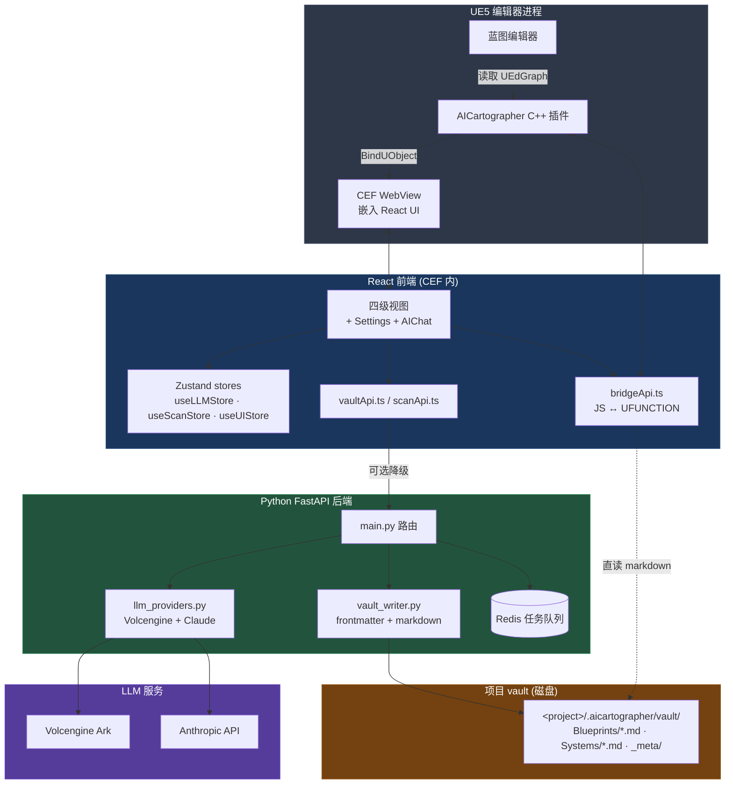

<div align="center">

# AICartographer

**[English](README.en.md) · 简体中文**

**为 Unreal Engine 5 而生的 AI 蓝图地图仪**

把整个 UE5 项目折叠成一张可点开、可叙事、可分析的地图 —— 由 LLM 给每个蓝图写下"它在做什么 / 谁调用谁"，由力导向图给你看清系统形状，由 Markdown vault 让你把笔记永久留在自己的项目里。

[](https://www.unrealengine.com/)
[](https://react.dev/)
[](https://vitejs.dev/)
[](https://fastapi.tiangolo.com/)
[](#license)

[功能特性](#功能特性) · [架构](#架构) · [四级视图](#四级视图) · [快速开始](#快速开始) · [便携包](#便携包安装推荐) · [LLM 厂商](#llm-厂商支持) · [开发](#开发)

</div>

---

## 这是什么

AICartographer 是一个嵌入 UE5 编辑器的 React 插件 + Python 后端，用 LLM 给整个项目的蓝图建一份"叙事地图"：

- **不是又一个蓝图浏览器** — 它写故事：每个 BP 的 markdown 页面会讲"`OnDamageReceived` 在 `CurrentHP <= 0` 时被 broadcast，被 `GameMode.HandleDeath` 消费"，而不是干巴巴列变量名。
- **不是又一个 AI 工具** — 它产出真正属于你项目的资产：所有 LLM 分析、笔记、tag 都落在 `<project>/.aicartographer/vault/` 下的 .md 文件里，**每位开发者本地一份**，不进 git（[原因和入职流程见下方](#团队协作vault-不进-git)）。
- **不是云端工具** — UE 编辑器和后端都跑在你本地，LLM key 由你输入并只活在 localStorage 里。

> 适合谁：处理过中大型 UE5 项目、想快速上手别人代码 / 自己旧项目的开发者。第一次拉到一个 50+ 蓝图的工程时，这玩意能让你少看 80% 的废墟。

---

## 功能特性

| 类别 | 能做什么 |
|---|---|
| **AI 叙事** | LLM 给每个蓝图写"INTENT / EXECUTION FLOW / MEMBER INTERACTIONS / EXTERNAL COUPLING / RISK"五段叙事 |
| **系统聚类** | L1 项目级 LLM 把蓝图聚成 3-8 个系统（combat / ai / spawn / ui ...），并写出跨系统耦合分析 |
| **四级视图** | Lv0 总览墙 → Lv1 系统级图 → Lv2 单个蓝图详情 → Lv3 函数内部 K2Node 流图 |
| **双视图模式** | 同一节点可在「Markdown 阅读」和「力导向图浏览」之间一键切换 |
| **多厂商 LLM** | 同时支持 Volcengine（Doubao / DeepSeek 等 Ark 端点）和 Anthropic Claude（含 extended-thinking 五档 effort） |
| **完整 i18n** | UI + LLM 输出整套支持中英切换，受控词表 / asset_path 保持英文以保兼容 |
| **持久笔记** | `## [ NOTES ]` 区段是开发者私有，重扫永不覆盖；AST 变化时会标 `notes_review_needed` |
| **本地优先** | 优先走 UE C++ Bridge 直读 vault；后端不可达时降级 HTTP，AI Chat 离线优雅降级 |
| **增量扫描** | AST hash 命中就跳过；framework scan（无 LLM）/ deep scan（单节点 LLM）/ batch scan（全量 LLM）三档可选 |

---

## 架构



**桥优先级**：C++ Bridge 可用就走 Bridge（无需启动 Python），缺失方法时降级到 `localhost:8000` HTTP。LLM 调用永远走后端（Bridge 不持有 key）。

---

## 四级视图

| 层级 | 名称 | 看什么 | 数据来源 |
|---|---|---|---|
| **Lv0** | CardWall | 项目总览：所有系统 / 蓝图 / C++ / Interface 的卡片墙 | `Systems/_overview.md` + 全 vault 索引 |
| **Lv1** | SystemGraph / SystemMarkdown | 单个系统内部的成员关系图（d3-force 力导向）或叙事 .md | `Systems/<axis>.md` |
| **Lv2** | BlueprintFocus / BlueprintGraph | 单个蓝图的 Exports / Variables / Edges / Backlinks 详情，或它内部成员的图 | `Blueprints/<name>.md` |
| **Lv3** | FunctionFlow | 单个函数的 K2Node 执行图（事件红 / 调用蓝 / 分支棕 / Cast 绿，exec 边带动画） | C++ Bridge `ReadBlueprintFunctionFlow` 直读 UEdGraph |

辅助：
- **AIChat** — 右下浮窗，把当前 Lv2 节点喂给 LLM 当上下文聊
- **QuickSwitcher** — `Cmd/Ctrl+P`，按标题 / tag / intent 模糊匹配跳转
- **Settings** — 项目根 + LLM 厂商配置 + 语言开关 + Rebuild backlinks / Rebuild MOCs

> _截图位待上传 — 在 `docs/images/` 下放 `lv0-cardwall.png` `lv1-graph.png` `lv2-focus.png` `lv3-flow.png`，再编辑此处的图片引用。_
>
> 
> 

---

## 团队协作（vault 不进 git）

vault 内容（`<project>/.aicartographer/vault/*.md`）是 LLM 给每个蓝图写的叙事笔记 + 结构化 frontmatter，**每位开发者本地一份**。它不进 git，原因有两个：

- LLM 输出每次有差异 → 进 git 会让每次扫描产生巨大 diff、merge 冲突频繁
- vault 取决于本地的 LLM key、模型选择、扫描时机 → 不同开发者扫出来的 .md 不会一致

### 新人入职流程

1. 拉代码（你的 UE 项目，不带 vault）
2. 启动 plugin，配置 LLM key 和模型（设置面板）
3. 点 **Run framework scan**（秒级，不调 LLM，写出骨架）
4. 顶栏 **Run project scan**（首次全量大约 15-30 分钟，取决于项目大小和模型）
5. 之后正常开发，AssetRegistry stale 监听会自动 mark 需要重扫的笔记（路线图阶段 A1）

### 共享什么 / 不共享什么

| 共享（进 git） | 不共享（本地） |
|---|---|
| UE 项目代码 + AICartographer plugin | `.aicartographer/vault/Blueprints/*.md` |
| 后端配置（`backend/.env.local` 除外） | `.aicartographer/vault/Systems/*.md` |
| 词表（`_meta/tag-vocabulary.json`，可选共享） | 你本地的 LLM key |

**你的 UE 项目 .gitignore 必须包含**：

```gitignore
.aicartographer/
```

（如果你 fork 的是 AICartographer 仓库本身，本仓库的 .gitignore 已经包含此规则。）

---

## 快速开始

两条路径：

| 你是 | 走哪条 | 总耗时 |
|---|---|---|
| 想直接用 / 把它发给同事 | [**便携包安装**](#便携包安装推荐) — 1.6 MB zip，三个 `.bat` | ~10 min |
| 想改源码 / 二次开发 | [**从源码构建**](#从源码构建) — 克隆仓库 + npm + pip | ~30 min |

---

## 便携包安装（推荐）

> 给"只想用上"的同事 — 不需要克隆仓库、不需要装 Node、不需要装 Memurai。仓库自带的便携 Redis 直接打进 zip。

### 前置

- Windows 10 / 11
- **Unreal Engine 5.6+**
- **Visual Studio 2022**（带"使用 C++ 的桌面开发"工作负载） — UE 第一次开项目时用它编插件
- **Python 3.11+** — 安装时务必勾 "Add Python to PATH"（[python.org/downloads](https://www.python.org/downloads/)）
- **LLM API key**：Volcengine endpoint id（`ep-...`）+ key，或 Anthropic API key
- **一个 UE C++ 项目**作为测试床；没有可在 Epic Launcher → Marketplace 免费下载 [Cropout sample](https://www.unrealengine.com/marketplace/en-US/product/cropout-sample-project)

### 步骤（约 10 分钟）

1. **拿到 zip** — 从 [GitHub Releases](https://github.com/Liamour/UE-Mapping/releases) 下，或自己构建：
   ```powershell
   git clone https://github.com/Liamour/UE-Mapping.git
   cd UE-Mapping
   .\dist\build-release.ps1
   # → release/AICartographer-Portable-<日期>.zip (1.6 MB)
   ```

2. **解压 + 启动后端** — 解压到任意目录（比如 `D:\AICartographer\`），双击 `START.bat`
   - 首次自动建 venv + pip install（1-3 分钟）
   - 看到 `OK Backend healthy at http://127.0.0.1:8000/api/health` 就成功了
   - **这个窗口别关** — 关了后端就停了。要停服务在窗口里按 Ctrl+C

3. **装插件到 UE 项目** — 双击 `INSTALL-PLUGIN.bat`
   - 自动列出 `Documents\Unreal Projects\` 下的项目，选编号或粘贴 `.uproject` 路径
   - 脚本拷 `plugin/AICartographer/` → `<你项目>/Plugins/AICartographer/`
   - 自动改 `.uproject` 把插件加到 `Plugins[]` 并启用

4. **第一次打开 .uproject** — 双击 `.uproject` 文件
   - UE 弹 "Missing Modules" 对话框 → 点 **Yes** 让它编插件（VS 后台跑 1-2 分钟）
   - Blueprint-only 项目会先弹"Add C++ class"引导转 C++（一次性）
   - 编完 UE 自动打开

5. **打开面板 + 配置** — UE 菜单 `Window` → `Developer Tools` → `Misc` → `AICartographer Web UI`
   - 右上角齿轮 → **Settings**
   - **Project root**：填 `.uproject` 所在文件夹（比如 `D:\MyGame`）
   - **Language**：English / 简体中文
   - **LLM Provider**：选 Volcengine 或 Claude → 填 key → 点 **Test connection** 看绿灯
   - Settings → **Run framework scan**（秒级、不烧钱、写出骨架 .md）
   - 顶栏 → **Run project scan**（吃 LLM 配额，30 秒~几分钟）
   - 完成后进 **Lv0** 总览 → 点系统进 **Lv1** → 点蓝图进 **Lv2** → 点函数进 **Lv3**

扫完后 vault 落在 `<你项目>/.aicartographer/vault/` 下，本地拥有，**不进 git**（[团队协作章节](#团队协作vault-不进-git) 解释了原因）。详细排错见 [INSTALL.md](INSTALL.md) 和便携包内的 `README-FIRST.txt`。

### 便携包目录结构

```
AICartographer-Portable-<日期>/
├── START.bat                 ← 启动后端（双击）
├── STOP.bat                  ← 停止 / 清理残留
├── INSTALL-PLUGIN.bat        ← 拷插件到一个 UE 项目
├── README-FIRST.txt          ← 给终端用户的 5 分钟指南
├── backend/                  ← Python 后端源码（100 KB）
├── plugin/AICartographer/    ← UE 插件 + 预编译 React WebUI（580 KB）
├── runtime/redis/            ← 便携 Redis 二进制（2.9 MB）
└── tools/                    ← launcher.py / install_plugin.py / stop.py
```

首次启动后会多出 `runtime/python-venv/`（约 150-200 MB），存 fastapi/uvicorn/anthropic/openai 等依赖。

---

## 从源码构建

> 想 hack 代码 / 二次开发走这条。如果只是用，请走上面的便携包。

### 前置条件

- **UE 5.7+**（构建好 AICartographer 插件）
- **Python 3.11+**（推荐 3.14；Win 用户注意 PATH 配 `C:\Python<ver>\Scripts`）
- **Node 20+**（开发前端用；UE webview 直接吃 build 好的单文件 bundle）
- **Redis**（任务队列；Win 自带的 3.0.504 已通过 pipeline-HSET 兼容）
- **LLM API key**：Volcengine ark.cn-beijing.volces.com endpoint id，或 Anthropic API key

### 1. 克隆 + 拉依赖

```bash
git clone https://github.com/Liamour/UE-Mapping.git
cd UE-Mapping

# 后端
cd backend
pip install -r requirements.txt

# 前端
cd ../UE_mapping_plugin
npm install
```

### 2. 启动后端

```powershell
# Redis
D:\path\to\Redis-x64-3.0.504\redis-server.exe

# FastAPI（新终端）
cd backend
python -m uvicorn main:app --reload --port 8000
```

### 3. 构建前端 bundle 到插件

```bash
cd UE_mapping_plugin
npm run build
# 自动写入 ../Plugins/AICartographer/Resources/WebUI/index.html (~508 kB single file)
```

### 4. 在 UE 里打开你的项目

- 把 `Plugins/AICartographer/` 拷到你 UE 项目的 `Plugins/`
- VS / Rider 重新 build C++ 模块（Live Coding 不能注册新 UFUNCTION）
- 打开编辑器 → AICartographer 标签

### 5. 配置 + 第一次扫描

1. Settings → Project root 填你的 UE 工程目录
2. Settings → LLM provider 配 key（Volcengine 或 Claude）→ Test connection
3. 选语言（English / 简体中文）
4. Settings → **Run framework scan**（无 LLM，秒级）→ 写出骨架 .md
5. 顶栏 **Run project scan**（L2 batch + L1 cluster，根据项目大小 30s ~ 几分钟）
6. 进 Lv0 看项目总览，点系统进 Lv1，点蓝图进 Lv2，点函数进 Lv3

### 打一份便携包发给同事

```powershell
.\dist\build-release.ps1                 # → release/AICartographer-Portable-<日期>.zip
.\dist\build-release.ps1 -Version 1.0.0  # 自定义版本号
.\dist\build-release.ps1 -NoZip          # 只生成目录，方便本地测
```

打包脚本只做拷贝，**不修改源码**。生成的 zip 是 1.6 MB，解压 3.6 MB。

---

## LLM 厂商支持

| Provider | 端点 | 模型选项 | 推理强度 |
|---|---|---|---|
| **Volcengine Ark** | `ark.cn-beijing.volces.com` | 自填 endpoint id（`ep-...`，可绑 Doubao / DeepSeek-R1 等） | — |
| **Anthropic Claude** | 官方 API | Opus / Sonnet / Haiku | low / medium / high / extra_high / max（映射到 extended-thinking budget） |

**密钥安全**：
- 用户在前端填入，存 `localStorage` 的 `aicartographer.llm.config`
- 每次请求随 payload 带给后端，后端**永不落盘**
- 后端 `.env` 没有任何 LLM key 字段

**可调参数**（Settings → LLM provider）：
- 并发 1–64（默认 20，限流避免触发供应商 RPM 上限）
- 语言 EN / ZH（同时影响 UI 和 LLM 输出）
- 单次请求 90s 超时 + tenacity 重试 4 次（指数 1–30s）

---

## 国际化

切换 `Settings → Language → 简体中文`：

- ✅ 整个 UI（21 个组件）
- ✅ LLM 输出叙事（intent / 章节正文）
- ✅ Markdown 模板（`## [ 简介 ]` `## [ 成员 ]` `## [ 反向链接 ]`）
- ✅ 风险提示（`> [!system_risk] 系统风险等级：**warning**`）
- ❌ 受控词表保留英文（`#system/combat` `#layer/gameplay` 等，前端解析所用 key）
- ❌ `asset_path` / blueprint 名 / 函数标识符（资产唯一 ID）

> 已存在的 .md 不会自动回填语言 — 需要重扫（删 vault / 改 AST / 点 Rebuild backlinks 至少更新反链段）

---

## 项目结构

```
UE-Mapping/
├── Plugins/AICartographer/              # UE5 C++ 插件
│   ├── Source/AICartographer/
│   │   ├── Public/AICartographerBridge.h     # UFUNCTION 暴露层
│   │   └── Private/AICartographerBridge.cpp  # ReadBlueprintFunctionFlow / RequestDeepScan / ListBlueprintAssets
│   └── Resources/WebUI/index.html       # vite-plugin-singlefile bundle 写入此处
│
├── UE_mapping_plugin/                   # React 前端
│   └── src/
│       ├── components/
│       │   ├── levels/                  # Lv0 / Lv1 / Lv2 / Lv3 视图
│       │   ├── shell/                   # ActivityBar / TopBar / Tabs / Breadcrumb
│       │   ├── settings/                # SettingsModal / LLMProviderPanel / ScanOrchestrator
│       │   ├── chat/AIChat.tsx
│       │   ├── search/QuickSwitcher.tsx
│       │   └── notes/NotesEditor.tsx
│       ├── services/
│       │   ├── bridgeApi.ts             # C++ Bridge wrapper
│       │   ├── vaultApi.ts              # vault HTTP/Bridge 双通路
│       │   ├── scanApi.ts               # batch scan
│       │   ├── frameworkScan.ts         # 骨架扫描（无 LLM）
│       │   └── projectScan.ts           # L1 项目聚类
│       ├── store/
│       │   ├── useLLMStore.ts           # 厂商 + 语言 + 并发
│       │   ├── useScanStore.ts          # 扫描进度 + 自动刷新
│       │   └── useUIStore.ts            # 视图模式 + 弹窗状态
│       └── utils/
│           ├── i18n.ts                  # useT() Hook + L10nMsg 类型
│           └── frontmatter.ts           # YAML 解析 + 嵌套→扁平规范化
│
├── backend/                             # Python FastAPI
│   ├── main.py                          # 路由 + L2 / L1 prompts
│   ├── llm_providers.py                 # LLMProvider ABC + Volcengine + Claude
│   ├── vault_writer.py                  # markdown 写入 + i18n 模板表
│   ├── tag_vocabulary_default.json      # 受控词表（system/layer/role）
│   └── requirements.txt
│
├── HANDOFF.md                           # 跨 session 完整工程交接文档（中文）
└── README.md                            # 本文件
```

---

## 开发

### TypeScript 类型检查

```bash
cd UE_mapping_plugin
npx tsc --noEmit
```

### 前端 dev server（HMR）

```bash
npm run dev
# 仅在浏览器开发时用；UE webview 是吃 build 好的 bundle
```

### 后端语法检查

```bash
cd backend
python -c "import ast; ast.parse(open('main.py', encoding='utf-8').read())"
```

### 添加新 UFUNCTION

每次在 `AICartographerBridge.h` 加新方法都需要**关 UE → VS / Rider 重新 build → 重启编辑器**。Live Coding 不能注册新 UCLASS / UPROPERTY / UFUNCTION。SettingsModal 的桥状态行会显示 `partial`（找到桥但缺方法）来提示需要 rebuild。

### 控制台规范

后端日志统一用 `[SYS_LOG]` `[SYS_WARN]` `[SYS_ERR]` `[L1]` `[VAULT]` 前缀，方便 grep。LLM key 在日志里走 `mask_key()` 脱敏。

---

## 已知限制

- **Redis 3.0.504**（Win 自带）不支持多字段 HSET — 已用 pipeline + 单字段写入绕过。要升级建议换 [Memurai](https://www.memurai.com/) 或 WSL2 + 官方 Redis 7.x。
- **Live Coding 限制** — 见上文，新 UFUNCTION 必须冷重启。
- **切语言不回填旧 .md** — `is_unchanged()` 跳过 AST 未变节点，需要 force rescan 才会用新语言重写模板。
- **L3 函数流暂无 LLM 分析** — 当前 L3 只做可视化，文字解读由 L2 的 `MEMBER INTERACTIONS` 章节承担。

---

## 路线图

- [ ] 真项目大规模实测（500+ BP 工程）
- [ ] AIChat 把当前打开的 Lv2/Lv3 节点喂给 LLM 当上下文
- [ ] Notes 双向同步（编辑 → 触发 backlinks 重建）
- [ ] L3 加 LLM 函数级叙事（"这个函数的执行流是 ..."）
- [ ] CPP / Interface 类型的扫描器（当前以 BP 为主）
- [ ] 集成测试（pytest + Playwright）

---

## License

MIT — 详见 [LICENSE](LICENSE)（如有）

---

<div align="center">

**Built with care, then handed off via [HANDOFF.md](HANDOFF.md).**

如果这个项目帮你看清了一个老 UE 工程，请告诉我：[Issues](https://github.com/Liamour/UE-Mapping/issues)

</div>
